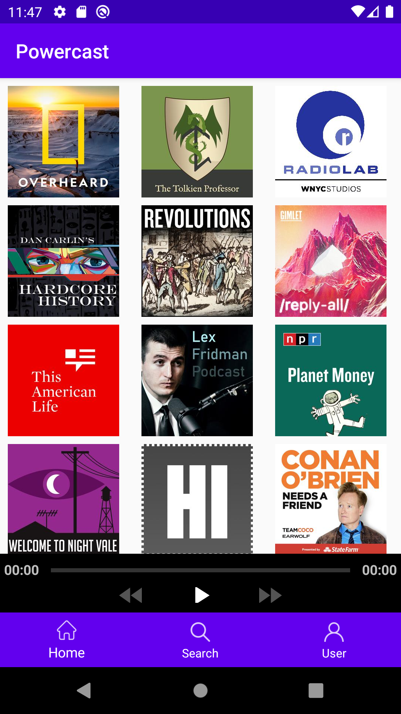

  

Powercast is a podcast application for Android smartphones. For my senior project at BYU-Idaho, I developed both the front-end Android application as well as a back-end Node.js server. The server uses Listennotes API to fetch and send podcast data. 

